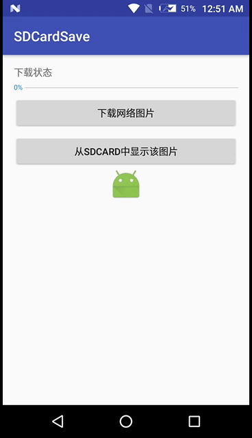

# SDCardSave

将文件保存到SDCard中
```java
    public static boolean saveFile2SDCard(byte[] data, String dir, String fileName) {
        BufferedOutputStream bos = null;
        if (isSDCardMounted()) {
            Log.i(TAG, "SDCard absolute path: " + getSDCardPath());
            File file = new File(getSDCardPath() + File.separator + dir);
            Log.i(TAG, "file save path: " + file.getAbsolutePath());
            if (!file.exists()) {
                boolean flag = file.mkdirs();
                Log.i(TAG, "file's dir is made success: " + flag);
            }
            try {
                bos = new BufferedOutputStream(new FileOutputStream(new File(file, fileName)));
                bos.write(data, 0, data.length);
                bos.flush();
                return true;
            } catch (IOException e) {
                e.printStackTrace();
            } finally {
                if (bos != null) {
                    try {
                        bos.close();
                    } catch (IOException e) {
                        e.printStackTrace();
                    }
                }
            }
        }
        return false;
    }
```

从SDCard中加载文件到内存中
```java
    public static byte[] loadFileFromSDCard(String filePath) {
        BufferedInputStream bis = null;
        ByteArrayOutputStream baos = null;
        if (isSDCardMounted()) {
            File file = new File(filePath);
            if (file.exists()) {
                try {
                    bis = new BufferedInputStream(new FileInputStream(file));
                    baos = new ByteArrayOutputStream();
                    byte[] buffer = new byte[8 * 1024];
                    int c = 0;
                    while ((c = bis.read(buffer)) != -1) {
                        baos.write(buffer, 0, c);
                        baos.flush();
                    }
                    return baos.toByteArray();
                } catch (IOException e) {
                    e.printStackTrace();
                } finally {
                    if (bis != null && baos != null) {
                        try {
                            bis.close();
                            baos.close();
                        } catch (IOException e) {
                            e.printStackTrace();
                        }
                    }
                }
            }
        }
        return null;
    }
```

注意要动态申请权限
```xml
<uses-permission android:name="android.permission.WRITE_EXTERNAL_STORAGE" />
```


